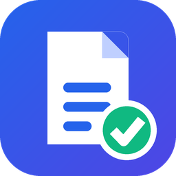
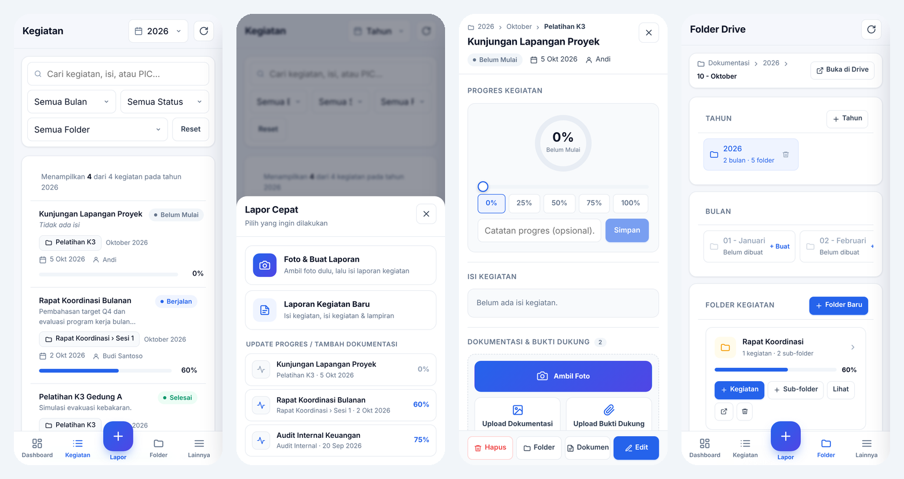

<p align="center">
  
</p>

<h1 align="center">DokuKegiatan</h1>

<p align="center">
  Aplikasi web <b>dokumentasi kegiatan kantor</b> berbasis <b>Google Apps Script</b>.<br>
  Semua laporan, foto, dan bukti dukung tersimpan rapi di Google Drive Anda sendiri:<br>
  <code>Tahun › Bulan › Folder kegiatan › Sub-folder</code>
</p>

<p align="center">
  
</p>

---

## ✨ Fitur

| | |
|---|---|
| 📁 **Struktur folder otomatis** | Tahun › Bulan › Folder kegiatan, dengan sub-folder bertingkat (maks. 8 level). Buat & hapus langsung dari aplikasi. |
| 📝 **Laporan kegiatan** | Nama, tanggal, PIC, dan isi kegiatan. Setiap kegiatan otomatis dibuatkan **Google Doc ringkasan** di foldernya. |
| 📊 **Progres 0–100%** | Slider + tombol cepat, catatan progres, dan riwayat (timeline). Status otomatis: Belum Mulai / Berjalan / Selesai. |
| 📷 **Kamera langsung** | Foto langsung dari aplikasi, dengan **cap hari, tanggal, jam & nama kegiatan** di foto. Ada fallback ke kamera bawaan HP. |
| 📎 **Bukti dukung** | Upload surat, daftar hadir, notulen, PDF, Word, Excel. Disimpan terpisah di subfolder `Bukti Dukung`. |
| 📈 **Dashboard** | KPI, grafik kegiatan per bulan, komposisi status, progres per folder, kegiatan perlu perhatian, aktivitas terbaru. |
| 📱 **Mobile-first** | Navigasi bawah, tombol **＋ Lapor** cepat, form layar penuh, dan mengingat folder & PIC terakhir. |
| 🗑️ **Hapus aman** | Folder dipindahkan ke Sampah Drive (bisa dipulihkan). Penghapusan besar wajib konfirmasi ketik nama. |
| 🗄️ **Tanpa server** | Database di Google Sheets (dibuat otomatis). Gratis, berjalan di akun Google Anda. |

## 🚀 Instalasi (± 5 menit)

1. Buat folder baru di Google Drive untuk menyimpan dokumentasi. Salin **ID folder** dari URL-nya:
   `https://drive.google.com/drive/folders/`**`1AbC...xyz`**
2. Buka [script.google.com](https://script.google.com) → **Proyek baru**.
3. Salin file dari folder [`src/`](src):
   - `Code.gs` → tempel ke file `Code.gs`
   - Klik **＋ → HTML** tiga kali, buat file bernama **`Index`**, **`Style`**, dan **`Script`** (tanpa `.html`), lalu tempel isinya.
   - *(Opsional)* **Setelan proyek ⚙ → Tampilkan file manifes**, lalu ganti `appsscript.json`.
4. Di `Code.gs`, isi ID folder Anda:
   ```js
   const ROOT_FOLDER_ID = 'GANTI_DENGAN_ID_FOLDER_DRIVE_ANDA';
   ```
5. Pilih fungsi **`setup`** → **Jalankan** → berikan izin akses (Drive, Docs, Sheets).
   Langkah ini membuat database Google Sheets dan ikon aplikasi di folder Anda.
6. **Terapkan → Deployment baru → Aplikasi web**
   - *Jalankan sebagai*: **Saya**
   - *Siapa yang memiliki akses*: sesuai kebutuhan (mis. hanya domain kantor)
7. Buka URL aplikasi web. Di HP: Chrome ⋮ → **Tambahkan ke layar utama**.

> Setiap kali kode diubah: **Terapkan → Kelola deployment → Edit → Versi baru**.

### Alternatif: pakai `clasp`

```bash
npm i -g @google/clasp
clasp login
clasp create --type webapp --title "DokuKegiatan" --rootDir src
clasp push
```
Setelah `clasp push`, lanjutkan dari langkah 4 di editor Apps Script.

## 🗂️ Struktur di Google Drive

```
📁 Folder root (ROOT_FOLDER_ID)
 ├─ 📄 Database - Dokumentasi Kegiatan      ← Google Sheets (Kegiatan & Riwayat Progres)
 ├─ 🖼 favicon-dokukegiatan.png             ← ikon tab browser (jangan dihapus)
 └─ 📁 2026
     └─ 📁 10 - Oktober
         └─ 📁 Pelatihan K3                  ← folder kegiatan (dibuat user)
             ├─ 📁 Hari 1                    ← sub-folder (opsional, bertingkat)
             │   ├─ 📄 Kegiatan - Simulasi Evakuasi   ← Google Doc ringkasan
             │   ├─ 🖼 Foto_20261003_110712_1.jpg      ← dokumentasi
             │   └─ 📁 Bukti Dukung
             │       └─ 📄 Daftar Hadir.pdf
             └─ 📁 Hari 2
```

## 🧱 Struktur repositori

```
├─ src/
│  ├─ Code.gs           # Backend: Drive, Sheets, Docs, upload, progres, hapus folder
│  ├─ Index.html        # Kerangka halaman & modal
│  ├─ Style.html        # CSS (responsif, mobile-first)
│  ├─ Script.html       # Logika antarmuka, kamera, dashboard
│  └─ appsscript.json   # Manifest (zona waktu Asia/Jakarta, V8)
├─ docs/
│  ├─ PANDUAN.md        # Panduan penggunaan lengkap
│  ├─ logo.png
│  └─ screenshot-mobile.png
├─ .clasp.json.example
└─ LICENSE
```

## ⚙️ Konfigurasi (di `Code.gs`)

| Konstanta | Keterangan |
|---|---|
| `ROOT_FOLDER_ID` | **Wajib.** ID folder Drive tempat dokumentasi disimpan. |
| `APP_NAME` | Nama aplikasi (judul tab & nama database). |
| `TZ` | Zona waktu, default `Asia/Jakarta`. |
| `FAVICON_URL` | Opsional. URL PNG publik untuk ikon tab (mis. logo kantor). |
| `MAX_DEPTH` | Kedalaman maksimal sub-folder (default 8). |

## 📌 Batasan

- Ukuran upload maksimal **25 MB per file** (batas `google.script.run`).
- Kamera langsung butuh izin kamera dari browser. Jika diblokir, aplikasi menawarkan kamera bawaan perangkat.
- Grafik memakai [Chart.js](https://www.chartjs.org/) dari CDN cdnjs.
- Ikon tab di-host sebagai file Drive yang dibagikan via link. Jika kebijakan Workspace melarang berbagi publik, isi `FAVICON_URL` secara manual.

## 🔒 Privasi

Aplikasi berjalan sepenuhnya di akun Google Anda. Tidak ada data yang dikirim ke server pihak ketiga, selain library Chart.js dan font Inter yang dimuat dari CDN publik.

## 📄 Lisensi

[MIT](LICENSE). Bebas digunakan, dimodifikasi, dan dibagikan.
